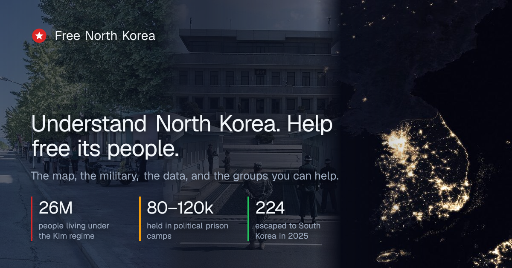
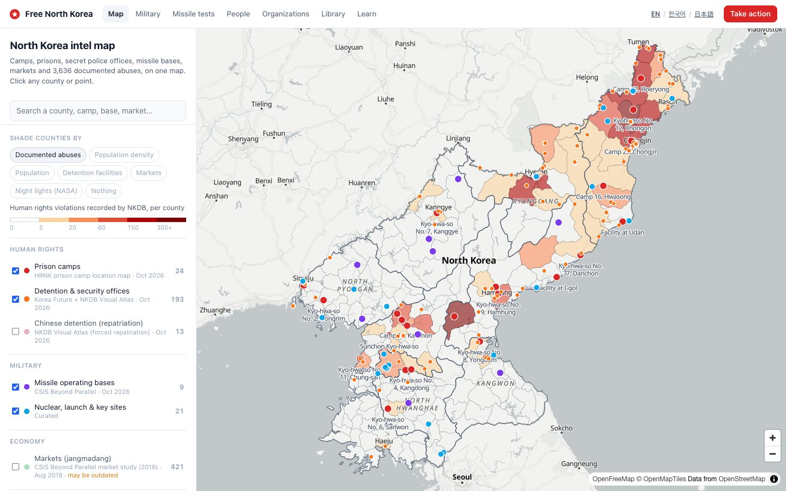
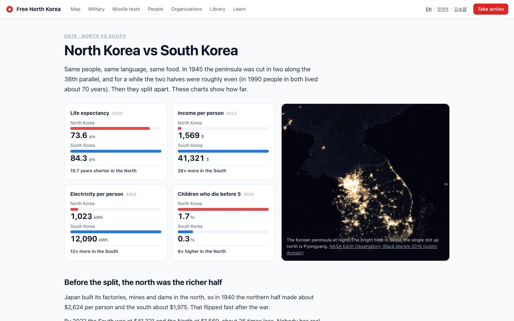
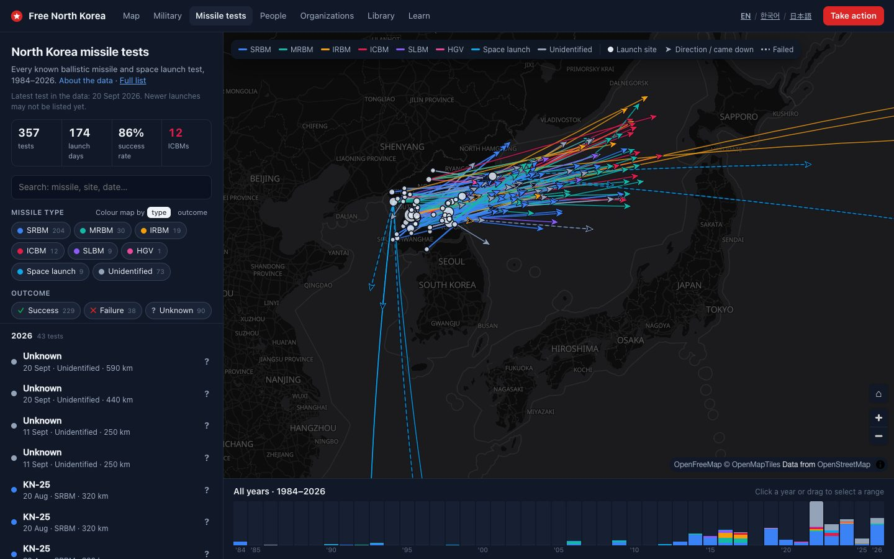
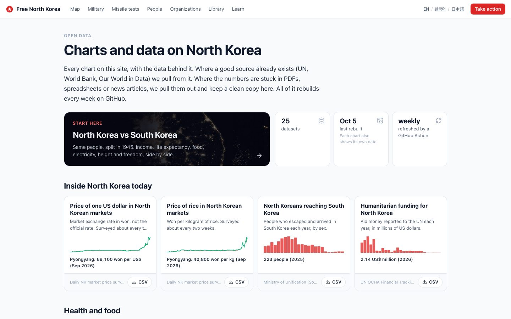
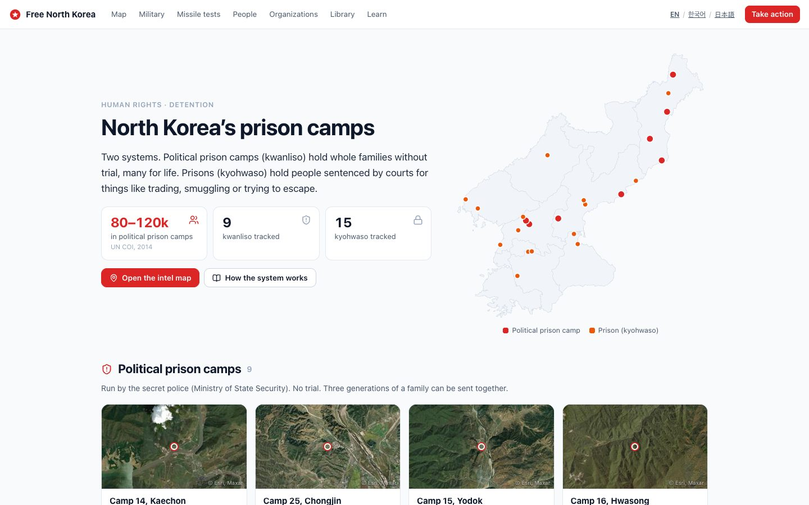
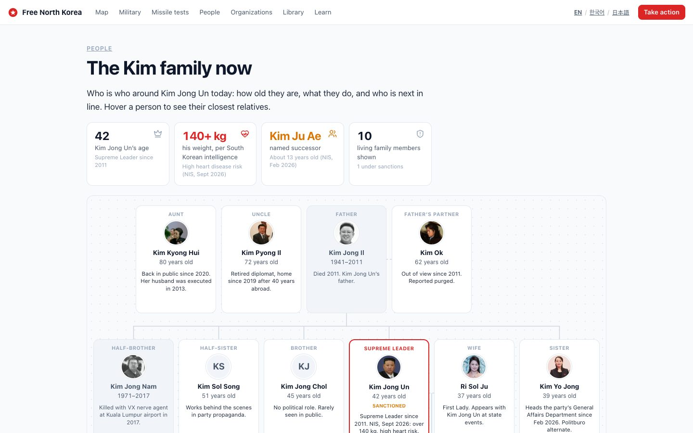
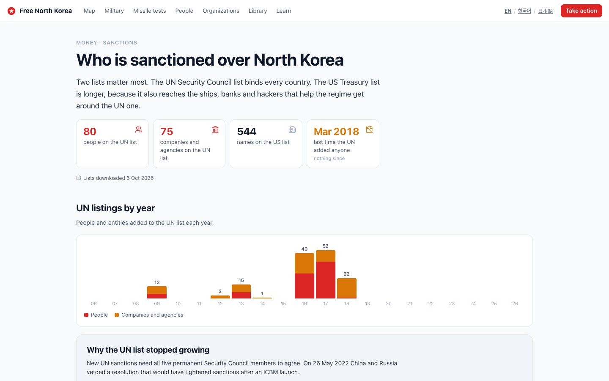
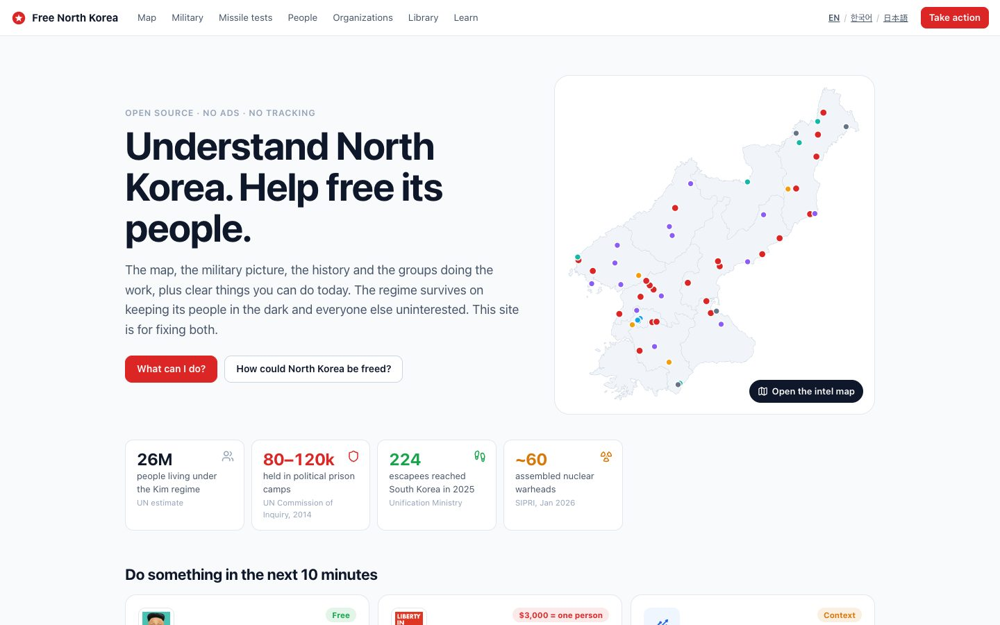

<div align="center">

<a href="https://liberatenorthkorea.org"></a>

### Understand North Korea. Help free its people.

An open-source hub for the 26 million people living under the Kim regime: the map, the military picture, the data,
the history, and the groups you can actually help.

[](https://liberatenorthkorea.org)
[](.github/workflows/check-sources.yml)
[](LICENSE)


**[Open the site](https://liberatenorthkorea.org)** ·
**[Intel map](https://liberatenorthkorea.org/map)** ·
**[North vs South](https://liberatenorthkorea.org/north-korea-vs-south-korea)** ·
**[Data](https://liberatenorthkorea.org/data)** ·
**[Take action](https://liberatenorthkorea.org/act)**

</div>

---

Nothing like this existed. The maps, the missile data, the archives, the sanctions lists and the organizations doing
the work were all in different places (half of them only in Korean or Japanese), and searching "how can North Korea
be freed" gave you close to nothing. So this puts it all in one place, open source, with a source on every fact.

| | | | | |
|:-:|:-:|:-:|:-:|:-:|
| **179** counties mapped | **24** political prison camps & prisons | **357** missile tests since 1984 | **25** open datasets | **159** sources watched weekly |

## What's inside

<table>
  <tr>
    <td width="50%" valign="top">
      <a href="https://liberatenorthkorea.org/map"></a>
      <h3>🗺 Intel map</h3>
      Prison camps, detention centres, nuclear and missile sites, 421 markets, the escape route through China, and
      human rights abuses counted per county. Every point has a source.
    </td>
    <td width="50%" valign="top">
      <a href="https://liberatenorthkorea.org/north-korea-vs-south-korea"></a>
      <h3>📊 North vs South Korea</h3>
      Same people, split in 1945. Income, life expectancy, food, electricity, height and freedom, side by side.
      In 1990 both lived about 70 years. Then the famine hit.
    </td>
  </tr>
  <tr>
    <td width="50%" valign="top">
      <a href="https://liberatenorthkorea.org/missiles"></a>
      <h3>🚀 Missile tests</h3>
      Every launch since 1984 on an interactive map with flight paths, filters and a timeline. A redesign of
      <a href="https://github.com/nagix/nk-missile-tests">nagix/nk-missile-tests</a> (CNS database), plus a plain
      <a href="https://liberatenorthkorea.org/missiles/list">table version</a>.
    </td>
    <td width="50%" valign="top">
      <a href="https://liberatenorthkorea.org/data"></a>
      <h3>📈 Charts & open data</h3>
      Our World in Data style charts: market prices and the won since 2009, defector arrivals, aid, missiles,
      sanctions. Every chart has a table, a CSV and a citation line.
    </td>
  </tr>
  <tr>
    <td width="50%" valign="top">
      <a href="https://liberatenorthkorea.org/camps"></a>
      <h3>⛓ Prison camps</h3>
      The kwanliso and kyohwaso system: who gets sent there, for what, and satellite views of each camp.
    </td>
    <td width="50%" valign="top">
      <a href="https://liberatenorthkorea.org/kim-family-tree"></a>
      <h3>👥 The Kim family & people</h3>
      Who is around Kim Jong Un today, 87 profiles of officials with sourced claims, and hover cards everywhere a
      name comes up.
    </td>
  </tr>
  <tr>
    <td width="50%" valign="top">
      <a href="https://liberatenorthkorea.org/sanctions"></a>
      <h3>🚫 Sanctions</h3>
      Everyone on the UN 1718 list and the US Treasury lists, downloaded fresh every week from the official files.
    </td>
    <td width="50%" valign="top">
      <a href="https://liberatenorthkorea.org"></a>
      <h3>🙋 Learn & act</h3>
      Sourced explainers on the questions people actually search for, a directory of 30+ groups doing rescue,
      information and resettlement work, and things you can do in 10 minutes.
    </td>
  </tr>
</table>

## Open data

All the chart data lives in [`data/series/`](data/series): one clean CSV per series plus a catalogue, rebuilt every
week by a GitHub Action. Use it, check it, build on it.

- **Pulled, not rebuilt.** Where someone already keeps the data well (Our World in Data, UN, World Bank, FAO,
  V-Dem) we pull it and credit them.
- **Pulled out and cleaned.** Where the numbers are stuck in PDFs, spreadsheets or news articles, we keep the clean
  copy ourselves: Daily NK market prices since 2009, Ministry of Unification defector arrivals, missile counts, UN
  sanctions listings by year.
- **Dated.** Every series carries the day it was downloaded and the source's own update date, and the site shows it.

The map layers, people graph and sanctions lists have their own builders too (see [LEARN.md](LEARN.md)).

## Run it locally

```bash
npm install
npm run dev      # http://localhost:3000
npm run build    # static pages + sitemap.xml
npm run lint     # oxlint + tsc + translation check
```

Refresh the chart datasets with `node scripts/build-series.ts` (needs `pdftotext` from poppler for the defector PDF).

Built with Next.js 16, React 19, TypeScript and MapLibre GL. Every page is statically generated and there is no
backend. Analytics is off unless `NEXT_PUBLIC_POSTHOG_KEY` is set, and even then it's cookieless and anonymous,
because some readers may be at risk.

## Contribute

Facts live in `src/content/` and `data/`, so most fixes are a one-line edit: a wrong number, a new organization, a
coordinate, a better source. Every fact needs a source, and everything a reader sees ships in English, Korean and
Japanese.

- [CONTRIBUTING.md](CONTRIBUTING.md): workflow and the safety rules (no one inside North Korea or any witness can
  ever be identifiable from this site).
- [LEARN.md](LEARN.md): architecture, the GIS pipeline and design decisions.
- Found something wrong or out of date? [Open an issue](https://github.com/Ahmet-Dedeler/free-north-korea/issues/new).

## Credits

Missile data © James Martin Center for Nonproliferation Studies / NTI, via nagix/nk-missile-tests. Basemap by
[OpenFreeMap](https://openfreemap.org) / OpenStreetMap contributors. Night imagery by NASA Earth Observatory. Share card photos: a street in Wonsan by Mario Micklisch (CC BY 2.0, a wide shot so no one is identifiable) and Panmunjom via Wikimedia Commons. Chart
data from the sources named on each chart. Map coordinates from Wikipedia unless marked approximate.

Code is [Apache 2.0](LICENSE). Each dataset keeps its original license.
