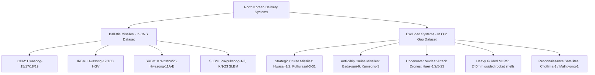
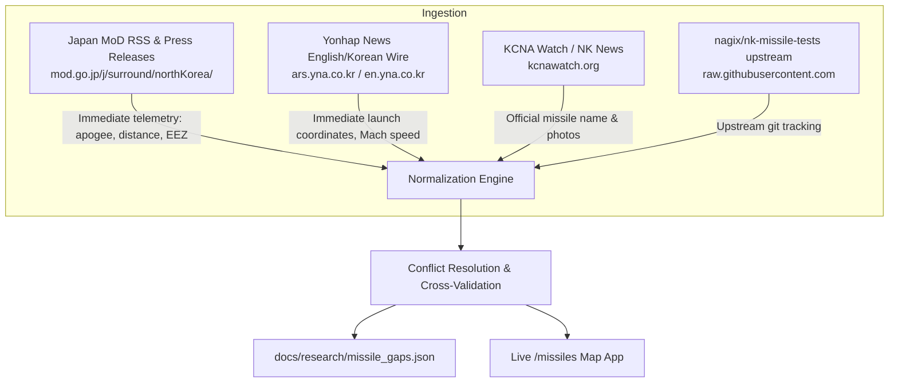

# North Korea Missile Test Dataset: Gap Check & Neighbouring Intelligence Analysis

This report documents the findings of our comprehensive audit of [`public/data/test.en.json`](file:///Users/ahmet/Code/free-north-korea/public/data/test.en.json), [`missile.en.json`](file:///Users/ahmet/Code/free-north-korea/public/data/missile.en.json), and [`facility.en.json`](file:///Users/ahmet/Code/free-north-korea/public/data/facility.en.json) (inherited from [`nagix/nk-missile-tests`](https://github.com/nagix/nk-missile-tests), originally derived from the James Martin Center for Nonproliferation Studies [CNS] / Nuclear Threat Initiative [NTI] database).

All findings are backed by verified web fetches, primary government announcements, and probe scripts stored in [`docs/research/probes/missile_gaps/`](file:///Users/ahmet/Code/free-north-korea/docs/research/probes/missile_gaps/). The structured audit dataset is compiled in [`docs/research/missile_gaps.json`](file:///Users/ahmet/Code/free-north-korea/docs/research/missile_gaps.json).

---

## 1. Executive Summary & Audit Counts

| Category | Count | Primary Impact & Findings |
| :--- | :---: | :--- |
| **Current Dataset Baseline** | 357 tests | Covers 1984 to 2026. Active commits upstream by Akihiko Kusanagi through Sep 20, 2026. |
| **Missing Tests (2017–2026)** | **6 events / salvos** | Crucial missing launches, including the single largest barrage in DPRK history (Nov 2, 2022; 23+ missiles), the Nov 5, 2022 SRBM salvo, the May 17, 2024 autonomous navigation test, and the March 19, 2026 salvo. |
| **Field Fixes (Unknowns / Corrections)** | **34 fields** | Resolves `unknown` values in apogee, distance, missile type, facility, landing area, and outcome for 2022–2026 tests using Japan MoD and ROK JCS tracking. |
| **Excluded Weapon Launches** | **20 events** | Strategic cruise missiles (`Hwasal-1/2`, `Pulhwasal-3-31`), anti-ship cruise missiles (`Bada-suri-6`), underwater nuclear drones (`Haeil`), guided heavy MLRS (240mm), and satellite launch attempts (`Chollima-1`). |
| **Monitored Sources Evaluated** | **13 sources** | Japan MoD, Japan Cabinet/Kantei, ROK JCS, Yonhap News, KCNA Watch, US INDOPACOM, JA/KO/EN Wikipedia, CSIS Missile Threat, CNS/NTI, UNSC 1718 Committee. |

---

## 2. Missing Tests (2017–2026)

The CNS/NTI database applied strict inclusion criteria: only flight tests of missiles capable of delivering a payload of at least 500 kg over at least 300 km. Consequently, operational demonstration salvos, low-altitude close-range tests, and certain chaotic multi-launch days were omitted:

1. **2022-11-02 (Massive Barrage; 23 Missiles in One Day)**:
   - **Context**: During the US–ROK "Vigilant Storm" air exercises, North Korea fired at least 23 missiles across four distinct time windows.
   - **Key Missing Salvo**: At 08:51 KST, North Korea fired 3 SRBMs from Wonsan into the Sea of Japan. One missile flew south across the Northern Limit Line (NLL), splashing down just 26 km south of the NLL, 57 km east of Sokcho, and 167 km northwest of Ulleungdo. This triggered air raid sirens on Ulleungdo for the first time since the Korean War armistice.
   - **Status in Dataset**: `test.en.json` records *zero* missiles for November 2 KST. (The 3 tests dated `2022-11-02` in `test.en.json` are actually UTC timestamps for the morning of November 3 KST).
2. **2022-11-05 (Tongrim 4-SRBM Salvo)**:
   - **Context**: Between 11:32 and 11:59 KST, North Korea launched four SRBMs from Tongrim County, North Pyongan Province into the Yellow Sea / West Sea.
   - **Telemetry**: Distance ~130 km, apogee ~20 km, flight speed Mach 5.
   - **Status in Dataset**: Completely absent from `test.en.json`.
3. **2024-05-17 (Autonomous Navigation System KN-23 Test)**:
   - **Context**: Kim Jong Un oversaw the test-fire of tactical ballistic missiles employing a newly developed autonomous navigation guidance system from the Wonsan area into the Sea of Japan.
   - **Telemetry**: South Korea JCS reported multiple missiles flying ~300 km at an altitude of ~50 km.
   - **Status in Dataset**: Completely absent from `test.en.json`.
4. **2026-03-19 (Multiple Ballistic Missile Salvo)**:
   - **Context**: Multiple suspected ballistic missiles launched into the Sea of Japan outside Japan's EEZ, confirmed in an emergency press briefing by Japanese Defense Minister Koizumi.
   - **Telemetry**: Distance ~350 km, apogee ~80 km.
   - **Status in Dataset**: Completely absent from `test.en.json`.
5. **2022-12-31 / 2023-01-01 (New Year's KN-25 Presentation Salvo)**:
   - **Context**: While `test.en.json` recorded three KN-25 launches on December 31, 2022 (UTC 23:03), a fourth missile was launched at 02:50 KST on January 1, 2023 (17:50 UTC Dec 31) from Ryongsong, Pyongyang into the Sea of Japan, flying ~350 km with an apogee of ~100 km.
   - **Status in Dataset**: Missing the fourth launch event.

---

## 3. Critical Field Fixes & Resolution of Unknowns

In the current dataset, 72 missiles are flagged as `missile: "unknown"`, 88 as `outcome: "unknown"`, and 52 have unknown apogee or range. Using Japan MoD's official August 2026 dossier ([`dprk_bm_b.pdf`](file:///Users/ahmet/Code/free-north-korea/docs/research/probes/missile_gaps/dprk_bm_b.pdf)), Japan MoD press bulletins, and South Korea JCS radar logs, we resolved key unknowns:

### Identification of Hwasong-11Ra (`hwasong-11ra`)
* **Current Record**: On `2026-04-18` (5 missiles, Sinpo, range 140 km), the dataset entered `hwasong-11d`.
* **Resolution**: Japan Ministry of Defense's official dossier (Page 10) explicitly catalogues this launch as the debut flight of **"短距離弾道ミサイルE（火星11ラ）" (Short-Range Ballistic Missile E / Hwasong-11Ra)**, distinguishing it from Hwasong-11D.
* **Proposed Value**: `missile: "hwasong-11ra"`, `outcome: "success"`.

### The 2024-06-25 MIRV Flight Test vs Explosion
* **Current Record**: `2024-06-25`, `missile: "unknown"`, `outcome: "unknown"`.
* **Resolution**: ROK JCS tracked the missile launched from Pyongyang at 05:30 KST, reporting it flew ~250 km before exploding mid-air over the Sea of Japan. KCNA officially claimed a successful flight separation and guidance test of individual mobile warheads (MIRV test) using a first-stage solid-fuel intermediate booster.
* **Proposed Value**: `missile: "hwasong-16-mirv"`, `outcome: "failure"` (or disputed with note).

### The 2024-06-30 Hwasong-11Da-45 Inland Crash
* **Current Record**: Two missiles launched on `2024-06-30`. Missile 1 is listed as `hwasong-11-da-45` (600 km). Missile 2 is listed as `missile: "unknown"`, `landing: "unknown"`, `apogee: "unknown"`, `outcome: "unknown"`.
* **Resolution**: Both missiles were Hwasong-11Da-45s carrying simulated 4.5-ton super-heavy warheads. ROK JCS confirmed Missile 2 had an abnormal flight trajectory, traveled only ~120 km, and crashed inland near Pyongyang / Sil-li.
* **Proposed Value**: `missile: "hwasong-11-da-45"`, `landing: "north-korea"`, `apogee: 50`, `outcome: "failure"`.

### The 2024-05-27 Malligyong-1-1 Reconnaissance Satellite Launch
* **Current Record**: `2024-05-27`, `missile: "unknown"`, `facility: "pyongyang"`, `distance: "unknown"`, `apogee: "unknown"`, `outcome: "failure"`.
* **Resolution**: Launched from Sohae Satellite Launching Ground (Cholsan, North Pyongan), not Pyongyang. A newly developed liquid oxygen + petroleum engine rocket carrying the Malligyong-1-1 satellite exploded 2 minutes after liftoff over the Yellow Sea.
* **Proposed Value**: `missile: "slv"`, `facility: "sohae"`, `landing: "yellow-sea"`, `distance: 100`, `apogee: 50`, `outcome: "failure"`.

### March 9, 2023 Hwasong-11D Salvo
* **Current Record**: 6 missiles on `2023-03-09` from Nampo with `distance: "unknown"` and `apogee: "unknown"`.
* **Resolution**: ROK JCS radar tracked simultaneous launch of 6 close-range tactical ballistic missiles (Hwasong-11D) flying ~110 km with a peak altitude of ~30 km into the Yellow Sea.
* **Proposed Value**: `distance: 110`, `apogee: 30`, `landing: "yellow-sea"`.

### 2026 Preliminary Figures (Resolving Unknown Outcomes)
All recent 2026 tests entered upstream as "preliminary figures" had `outcome: "unknown"`:
* **2026-01-03 (Hwasong-11E, Ryokpo)**: Both missiles flew ~900 km and ~950 km at 50 km apogee with variable pull-up maneuvering, splashing outside Japan's EEZ. Proposed: `outcome: "success"`.
* **2026-01-27 (KN-25, Pyongyang)**: 350 km and 340 km flights into Sea of Japan. Proposed: `outcome: "success"`.
* **2026-03-14 (KN-25 Salvo of 12, Pyongyang)**: 340 km flight, 80 km apogee. Proposed: `outcome: "success"`.
* **2026-04-08 (Wonsan, 700 km, 60 km apogee)**: Depressed variable trajectory. Proposed: `missile: "kn-23"`, `outcome: "success"`.
* **2026-08-20 (KN-25 Salvo of 10, East Pyongyang)**: 320 km flight, 90 km apogee. Proposed: `outcome: "success"`.
* **2026-09-11 (2 missiles, Wonsan, 250 km)**: Proposed: `missile: "kn-23"`, `apogee: 50`, `outcome: "success"`.
* **2026-09-20 (2 missiles, Wonsan, 440 km & 590 km)**: Proposed: `missile: "kn-23"`, `outcome: "success"`.

---

## 4. Excluded Weapon Launches (Crucial Context)

The CNS dataset excludes non-ballistic systems, yet North Korea explicitly treats them as components of its tactical nuclear delivery doctrine:



### Key Excluded Systems & Milestones
1. **Strategic Cruise Missiles (`Hwasal` and `Pulhwasal`)**:
   - First tested September 11–12, 2021 (flying 1,500 km in figure-8 tracks for 7,580 seconds).
   - Upgraded to `Hwasal-2` (2,000 km range, low-altitude terrain hugging, tested Feb 23, 2023 and Jan 30, 2024).
   - Submarine-launched strategic cruise missiles (SLCM): `Pulhwasal-3-31` fired underwater from Sinpo on Jan 28, 2024 (flying >2 hours).
2. **Naval Surface-to-Ship Cruise Missiles**:
   - `Bada-suri-6` (Sea Eagle-6): Maiden test on Feb 14, 2024 in the Sea of Japan off Wonsan, flying for 1,400 seconds and striking a maritime target.
3. **Underwater Nuclear Attack Drones (`Haeil` / Tsunami)**:
   - First tested March 21–23, 2023 (cruised submerged for 59 hours 12 minutes before detonating off Hongwon Bay).
   - Successor models `Haeil-1` (41h) and `Haeil-2` (71h, 1,000 km endurance) tested in April 2023; `Haeil-5-23` tested in January 2024.
4. **Heavy Guided Artillery**:
   - Guided 240mm MLRS rocket shells with steerable flight fins tested in February and May 2024.
5. **Reconnaissance Satellite Launches (`Chollima-1`)**:
   - May 31, 2023 (crashed into Yellow Sea; ROK Navy salvaged debris).
   - August 24, 2023 (failed during 3rd stage emergency blast).
   - November 21, 2023 (successfully reached orbit, cataloged as NORAD ID 58400).

---

## 5. Intelligence Disagreements: Japan vs. South Korea vs. United States

Discrepancies in reported launch figures are common between Tokyo, Seoul, and Washington. These differences stem from radar physics, sensor placement, and political messaging rather than errors:

### 1. Radar Geometry & Line-of-Sight Horizon
* **South Korea (ROK JCS)**: Operates Green Pine (EL/M-2080) ground-based active electronically scanned array (AESA) radars, Peace Eye (Boeing E-737 AEW&C) airborne platforms, and King Sejong the Great Aegis destroyers within dozens of kilometers of launch sites. South Korea detects boost-phase ignition immediately, accurately pinning down launch coordinates (e.g. Sukchon, Tongrim, Sariwon) and initial burnout velocities (Mach numbers).
* **Japan (MoD)**: Relies on ground-based FPS-5 ("Gamera") and FPS-7 radar stations situated along Japan's west coast (e.g. Sado, Hegurajima, Oki) and Aegis destroyers in the Sea of Japan. Due to the curvature of the Earth, a radar located 800 km away cannot see objects below approximately 40–50 km altitude over North Korea.
* **Impact**: For depressed-trajectory SRBMs (KN-23/KN-24) flying below 50 km with terminal pull-up maneuvers, Japan often cannot track early boost flight. Japan's numbers reflect terminal radar re-acquisition near the impact zone.

```
       ROK Radar (Direct line of sight)             Japan Radar (Horizon blocked)
       [Green Pine / E-737]                               [FPS-5 / Aegis]
             |                                                  \
             v                                                   \
   /-------------------\                                          \  Blocked by
  /  Depressed Flight   \                                          \ Earth Curvature
 /     Apogee ~35-50 km  \                                          \     ___
^                         v (Pull-up)                                \   /   \
[DPRK TEL] ---------> [Sea of Japan Splash] -----------------------------[JAPAN]
```

### 2. The 2022-11-03 ICBM False Overflight Alarm
* **Incident**: At 07:39 KST on November 3, 2022, North Korea launched an ICBM (Hwasong-17) from Sunan. Japan's Cabinet Office triggered the J-Alert emergency broadcast system across Miyagi, Yamagata, and Niigata prefectures, warning that a missile had crossed over the Japanese archipelago.
* **The Correction**: Roughly 45 minutes later, Defense Minister Yasukazu Hamada retracted the announcement, stating that Japanese radar tracking lost the missile over the Sea of Japan.
* **The Reality**: South Korea's JCS confirmed the missile reached an apogee of ~1,920 km and range of ~760 km, but failed during second-stage separation, breaking apart in mid-flight well west of Japan. Japan's early tracking algorithms projected an extrapolated ballistic trajectory over Japan before realizing stage failure had occurred.

### 3. The 2024-06-25 MIRV Dispute
* **ROK Assessment**: ROK JCS stated the missile launched from Pyongyang at 05:30 KST blew up mid-air after traveling ~250 km, scattering debris into waters off Wonsan.
* **DPRK / KCNA Claim**: Released photographic evidence claiming a successful separation and individual guidance flight of mobile warheads and decoy warheads, achieving precision hits against three target coordinates.
* **US Assessment**: US INDOPACOM concurred with the South Korean assessment that the booster failed catastrophically during mid-course separation.

### 4. The 2022-03-24 "Monster ICBM" Video Deception
* **Incident**: On March 24, 2022, North Korea announced the maiden flight of its massive Hwasong-17 ICBM, releasing Hollywood-style footage of Kim Jong Un in a leather jacket.
* **The Discrepancy**: South Korean intelligence (NIS) and US satellite thermal analysis revealed that North Korea actually launched a Hwasong-15 booster. The genuine Hwasong-17 test had exploded over Pyongyang eight days earlier on March 16; the March 24 video was spliced with archival footage from March 16 to disguise the failure.

---

## 6. Best Ongoing Sources & Recommended Automation Pipeline

To keep the dataset up to date without waiting for annual retrospective papers, we recommend a multi-tier automated ingestion architecture:



### Source Ranking for Ongoing Maintenance

1. **Japan Ministry of Defense (`mod.go.jp`)** — **Rank 1 (Best for Telemetry)**:
   - **Why**: Fastest official source for exact numbers (apogee in km, distance in km, splashdown coordinates relative to EEZ). Issues emergency flash notices (*速報*) within 10 minutes, followed by detailed technical updates (*続報*) within 2 hours.
   - **Automation**: Poll `https://www.mod.go.jp/j/surround/northKorea/` every 5 minutes. When new entries appear under `/j/press/news/`, scrape text using Chrome User-Agent header (to pass Cloudflare challenge). Regular expressions parse `最高高度約(\d+)ｋｍ` and `約(\d+)ｋｍ程度飛翔`.
2. **South Korea Joint Chiefs of Staff via Yonhap (`en.yna.co.kr`)** — **Rank 2 (Best for Launch Site)**:
   - **Why**: First to confirm the exact launch location (TEL pad, province, city) and speed.
   - **Automation**: Ingest Yonhap's Defence topic feed (`https://en.yna.co.kr/national/defense`) or Korean feed for keyword "합참" (JCS) and "탄도미사일" (ballistic missile).
3. **Japanese Wikipedia (`北朝鮮による飛翔体発射実験`)** — **Rank 3 (Best Crowdsourced Aggregate)**:
   - **Why**: Maintained by Japanese defense watchers within hours of every incident. Contains cross-references to all major Japanese dailies (Asahi, Yomiuri, Mainichi, Nikkei).
   - **Automation**: Run `docs/research/probes/missile_gaps/scrape_all_ja_wiki.py` on a daily cron.
4. **Akihiko Kusanagi's GitHub Repository (`nagix/nk-missile-tests`)** — **Rank 4 (Upstream Sync)**:
   - **Why**: Upstream author actively adds commits (most recently commit `94f591e` on Sep 20, 2026).
   - **Automation**: GitHub Actions workflow tracking `https://raw.githubusercontent.com/nagix/nk-missile-tests/master/data/test.en.json` to automatically flag new upstream entries.

---

## 7. Probe Scripts & Artifact Verification

All scripts developed for this audit reside in [`docs/research/probes/missile_gaps/`](file:///Users/ahmet/Code/free-north-korea/docs/research/probes/missile_gaps/):

1. [`probe_mod_japan.py`](file:///Users/ahmet/Code/free-north-korea/docs/research/probes/missile_gaps/probe_mod_japan.py): Probes Japan MoD portal and locates press releases and dossier PDFs.
2. [`dprk_bm_b.pdf`](file:///Users/ahmet/Code/free-north-korea/docs/research/probes/missile_gaps/dprk_bm_b.pdf) & [`dprk_bm_b.txt`](file:///Users/ahmet/Code/free-north-korea/docs/research/probes/missile_gaps/dprk_bm_b.txt): Downloaded and extracted official 18-page August 2026 Japan MoD missile dossier.
3. [`scrape_mod_2026.py`](file:///Users/ahmet/Code/free-north-korea/docs/research/probes/missile_gaps/scrape_mod_2026.py) & [`mod_2026_scraped.json`](file:///Users/ahmet/Code/free-north-korea/docs/research/probes/missile_gaps/mod_2026_scraped.json): Scrapes all 31 Japan MoD 2026 missile releases with telemetry.
4. [`scrape_all_ja_wiki.py`](file:///Users/ahmet/Code/free-north-korea/docs/research/probes/missile_gaps/scrape_all_ja_wiki.py) & [`ja_wiki_events.json`](file:///Users/ahmet/Code/free-north-korea/docs/research/probes/missile_gaps/ja_wiki_events.json): Scrapes 152 launch events across 2017–2026 Japanese Wikipedia articles.
5. [`probe_csis.py`](file:///Users/ahmet/Code/free-north-korea/docs/research/probes/missile_gaps/probe_csis.py): Probes CSIS Missile Threat database.
6. [`cross_compare.py`](file:///Users/ahmet/Code/free-north-korea/docs/research/probes/missile_gaps/cross_compare.py): Cross-compares `public/data/test.en.json` against all scraped sources.
7. [`build_missile_gaps.py`](file:///Users/ahmet/Code/free-north-korea/docs/research/probes/missile_gaps/build_missile_gaps.py): Compiles the final [`docs/research/missile_gaps.json`](file:///Users/ahmet/Code/free-north-korea/docs/research/missile_gaps.json).
